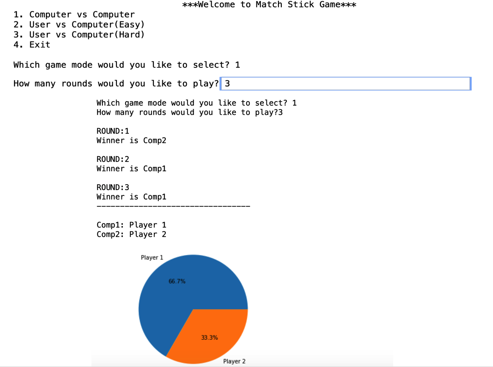

## Match Stick Game (2-Player & 3 Modes)

This is the repository for my final project assignment for programming with Python course.

## Description

The game begins with 31 matchsticks. On each player’s turn, the player may remove 1, 2, 3, or 4 matchsticks from the pile of matchsticks. The player who takes the last matchstick loses the game, so each player must strategize to leave the other player with the last matchstick. Program prompts user to enter number of rounds for each game.
A pie chart will be plotted to show statistics for winning of each player.
Mode 1 is designed to simulate fast play to test the game in easy mode.
Mode 2 is User vs Computer in which computer plays in easy mode,
Mode 3 is designed such that computer strategize the game in a way user will never win any games. Don't believe me?!! Try it in Hard mode! You'll see ;)

## Libraries

Matplotlib.pyplot is needed for pie-chart visualization.
